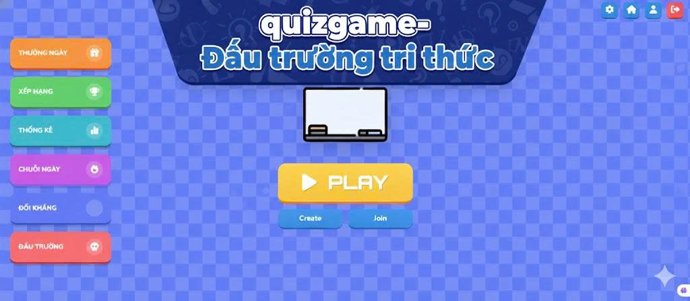
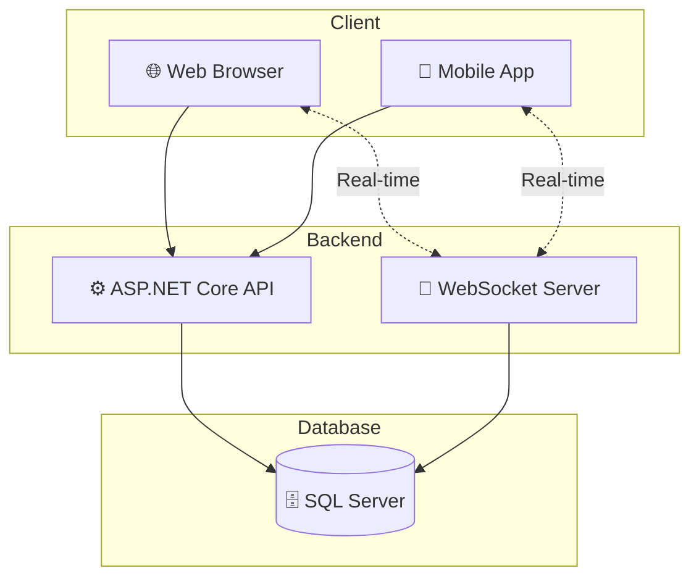

# 🎮 QUIZ GAME - ĐẤU TRƯỜNG TRI THỨC

**🏆 Nền tảng game trắc nghiệm trực tuyến hiện đại với tính năng real-time và hệ thống xếp hạng**

---

## 📋 Giới thiệu

**QUIZ GAME - ĐẤU TRƯỜNG TRI THỨC** là một ứng dụng game trắc nghiệm được xây dựng trên nền tảng ASP.NET Core 8.0, cho phép người dùng tham gia các bài quiz đa dạng, thi đấu trực tuyến với nhau và theo dõi thành tích qua hệ thống xếp hạng.

---

### 🎯 Dành cho Người dùng

| Tính năng | Mô tả |
|-----------|-------|
| 📝 **Quiz hàng ngày** | Tham gia các bài quiz được cập nhật mỗi ngày |
| 🎨 **Quiz tùy chỉnh** | Tạo và chơi quiz theo chủ đề yêu thích |
| 🤝 **Quiz chia sẻ** | Chia sẻ quiz với bạn bè và cộng đồng |
| ⚔️ **Chế độ đối kháng** | Thi đấu trực tuyến real-time với người chơi khác |
| 📊 **Lịch sử chơi** | Xem lại kết quả và phân tích các câu trả lời sai |
| 🎁 **Phần thưởng & Thành tựu** | Nhận phần thưởng và mở khóa thành tựu |

## 🛠️ Công nghệ sử dụng

### 💻 Backend
| Công nghệ | Mô tả |
|-----------|-------|
| **ASP.NET Core 8.0** | Framework chính |
| **Entity Framework Core 8.0** | ORM cho database |
| **SQL Server** | Cơ sở dữ liệu quan hệ |
| **JWT Bearer** | Xác thực và phân quyền |
| **WebSocket** | Giao tiếp real-time |
| **Swagger/OpenAPI** | Tài liệu API |

### 🎨 Frontend
| Công nghệ | Mô tả |
|-----------|-------|
| **Java (Android Native)** | Ngôn ngữ chính cho Android Studio |
| **XML Layouts** | UI Framework để xây dựng giao diện |

---

## 📚 API Documentation

### 🔌 WebSocket Endpoint

| Endpoint | Mô tả |
|----------|-------|
| `ws://host/ws/game` | Kết nối WebSocket cho chế độ đối kháng real-time |

> **Note**: Sử dụng query string `?access_token=YOUR_JWT_TOKEN` để xác thực

---

### 🏠 Home API

| Method | Endpoint | Mô tả |
|--------|----------|-------|
| GET | `/api/Home` | Kiểm tra trạng thái API (Smoke Test) |
| GET | `/api/Home/HealthCheck` | Kiểm tra kết nối Database (Health Check) |

---

### 🔐 Account API (Xác thực)

| Method | Endpoint | Mô tả |
|--------|----------|-------|
| POST | `/api/Account/login` | Đăng nhập và nhận JWT Token |
| POST | `/api/Account/register` | Đăng ký tài khoản mới |
| POST | `/api/Account/change-password` | Đổi mật khẩu (yêu cầu đăng nhập) |
| POST | `/api/Account/logout` | Đăng xuất và hủy phiên đăng nhập |

---

### 🎮 Quiz - Chơi Game API

| Method | Endpoint | Mô tả |
|--------|----------|-------|
| POST | `/api/Choi/start` | Bắt đầu phiên làm bài quiz |
| POST | `/api/Choi/submit` | Nộp đáp án cho câu hỏi |
| POST | `/api/Choi/end/{attemptId}` | Kết thúc phiên và xem kết quả |
| GET | `/api/Choi/next/{attemptId}` | Lấy câu hỏi tiếp theo |

---

### 📅 Quiz Ngày API

| Method | Endpoint | Mô tả |
|--------|----------|-------|
| GET | `/api/QuizNgay/today` | Lấy quiz của ngày hôm nay |
| POST | `/api/QuizNgay/start` | Bắt đầu làm Quiz Ngày |
| POST | `/api/QuizNgay/submit` | Nộp đáp án Quiz Ngày |
| POST | `/api/QuizNgay/end/{attemptId}` | Kết thúc Quiz Ngày và xem kết quả |

---

### 🎨 Quiz Tùy Chỉnh API

| Method | Endpoint | Mô tả |
|--------|----------|-------|
| GET | `/api/QuizTuyChinh/my-submissions` | Lấy danh sách đề xuất quiz của tôi |
| GET | `/api/QuizTuyChinh/{quizId}` | Xem chi tiết đề xuất quiz |
| POST | `/api/QuizTuyChinh/submit` | Gửi đề xuất quiz mới |
| DELETE | `/api/QuizTuyChinh/{quizId}` | Xóa đề xuất quiz |

---

### 🤝 Quiz Chia Sẻ API

| Method | Endpoint | Mô tả |
|--------|----------|-------|
| POST | `/api/QuizChiaSe/share` | Chia sẻ quiz cho người khác |
| GET | `/api/QuizChiaSe/sent` | Danh sách quiz đã gửi |
| GET | `/api/QuizChiaSe/received` | Danh sách quiz nhận được |
| GET | `/api/QuizChiaSe/{id}` | Chi tiết một lần chia sẻ |

---

### ❓ Câu Hỏi API

| Method | Endpoint | Mô tả |
|--------|----------|-------|
| GET | `/api/CauHoi/incorrect-review` | Lấy câu hỏi sai để ôn tập |
| GET | `/api/CauHoi/total-count` | Tổng số câu hỏi trong hệ thống |
| GET | `/api/CauHoi/statistics` | Thống kê câu hỏi theo chủ đề/độ khó |

---

### 📊 Lịch Sử Chơi API

| Method | Endpoint | Mô tả |
|--------|----------|-------|
| GET | `/api/LichSuChoi/my` | Danh sách kết quả của tôi (phân trang) |
| GET | `/api/LichSuChoi/{attemptId}` | Chi tiết một lần làm bài |
| GET | `/api/LichSuChoi/streak` | Chuỗi ngày chơi liên tiếp |
| GET | `/api/LichSuChoi/achievements` | Danh sách thành tựu đã đạt |

---

### ❌ Câu Sai API

| Method | Endpoint | Mô tả |
|--------|----------|-------|
| GET | `/api/quiz/CauSai/recent` | Danh sách câu sai gần đây |
| GET | `/api/quiz/CauSai/count/{attemptId}` | Đếm số câu sai trong 1 lần làm bài |

---

### 👤 Profile API

| Method | Endpoint | Mô tả |
|--------|----------|-------|
| GET | `/api/user/Profile/me` | Lấy thông tin hồ sơ cá nhân |
| PUT | `/api/user/Profile/me` | Cập nhật thông tin hồ sơ |
| PUT | `/api/user/Profile/settings` | Cập nhật cài đặt người dùng |

---

### 🏆 Achievement API (Thành tựu)

| Method | Endpoint | Mô tả |
|--------|----------|-------|
| GET | `/api/user/Achievement/me` | Lấy thành tựu của tôi |
| GET | `/api/user/Achievement/streak` | Lấy chuỗi ngày chơi |
| POST | `/api/user/Achievement/daily-reward` | Nhận thưởng hằng ngày |
| GET | `/api/user/Achievement/my-rewards` | Danh sách quà tặng của tôi |

---

### ⚔️ Trận Đấu Online API

| Method | Endpoint | Mô tả |
|--------|----------|-------|
| POST | `/api/trandau/create` | Tạo phòng đối kháng mới |
| POST | `/api/trandau/join/{matchCode}` | Tham gia phòng đối kháng |
| GET | `/api/trandau/status/{matchCode}` | Kiểm tra trạng thái trận đấu |
| GET | `/api/trandau/history` | Lịch sử các trận đấu |
| GET | `/api/trandau/detail/{matchCode}` | Chi tiết trận đấu |
| GET | `/api/trandau/online-count` | Số người đang online |
| DELETE | `/api/trandau/cancel/{matchCode}` | Hủy phòng đối kháng |

---

---

## 🎯 Kiến trúc hệ thống

---

## 📄 License

Dự án được phát triển cho mục đích học tập.

---

**⭐ Nếu thấy hữu ích, hãy cho dự án một star nhé! ⭐**

Made with nhóm 7 - 125LTTD02 ❤️

